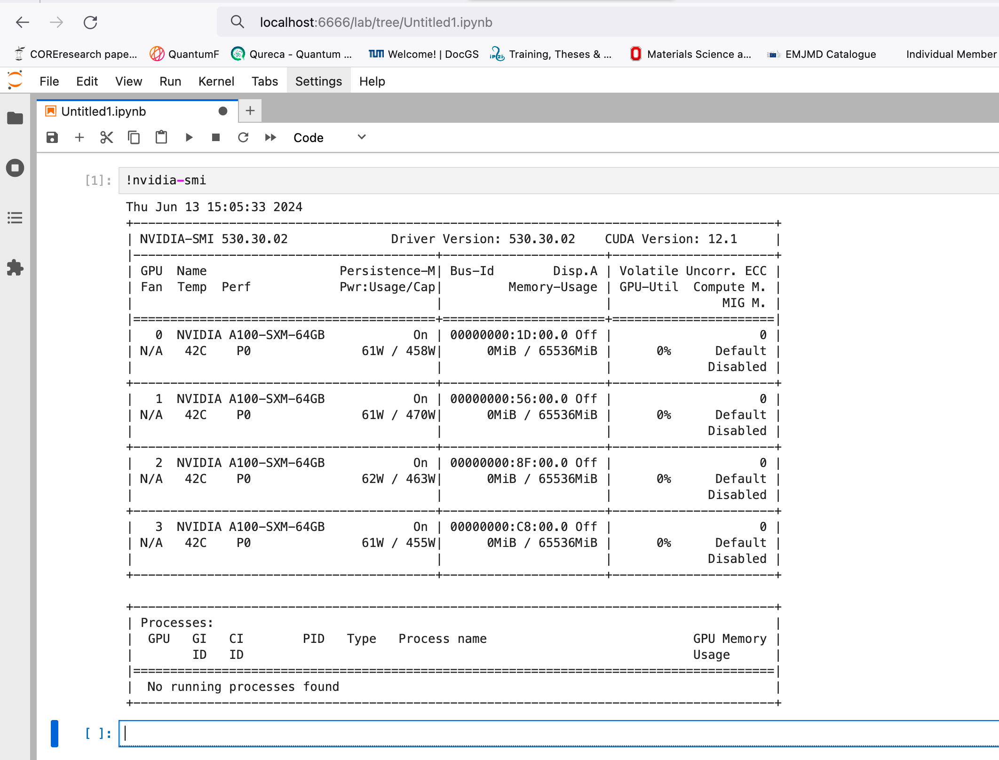

# Launch Jupyter lab from HPC compute nodes

This guide provides a straightforward approach to launching a Jupyter Lab server from a compute node of an HPC cluster (I am using the Leonardo for this tutorial). This tutorial is tested on Leonardo Cineca supercomputer, SISSA Ulysses and Moroccan Marwan cluster, these steps are valid for all the other clusters.

### HPC cluster side (Leonardo supercomputer as an example)

1. Prior to proceeding, confirm that Jupyter Notebook is installed in your home directory on the login node. Once verified, follow these steps:

* Generate a configuration file for jupyter:s

 ```
(ZHPC) [zdahbi00@login01 jupyter-server]$ jupyter lab --generate-config
```


* Generate a hashed password that you will use to login to jupyter:
 
```(ZHPC) [zdahbi00@login01 jupyter-server]$ jupyter notebook password
Enter password: 
Verify password: 
[JupyterPasswordApp] Wrote hashed password to /leonardo/home/userexternal/zdahbi00/.jupyter/jupyter_server_config.json
```


2. Modify the configuration file ```jupyter_lab_config.py```:

```
(ZHPC) [zdahbi00@login01 jupyter-server]$ vim ~/.jupyter/jupyter_lab_config.py
(ZHPC) [zdahbi00@login01 jupyter-server]$ head ~/.jupyter/jupyter_lab_config.py
# Configuration file for lab.

c = get_config()  #noqa
c.NotebookApp.open_browser = False
c.NotebookApp.port = 6666  
```

where ```6666``` is the port (you can change it: choose any 4 numbers!).


3.  Choose the resources you want to allocate by modifying the job script ``` jupy_leonardo.job``` and execute the job.

```
(ZHPC) [zdahbi00@login01 jupyter-server]$ sbatch jupyter.job 
```

4. Run ```squeue -u your_username``` and get the hostname of the allocated node. For leonardo supercomputer, the hostnames of the compute nodes are something like ```lrdnxxxx```.  


### Local machine side (Your local terminal)

5. Modify line 3 of the script ```run_jupy.sh``` by changing username with the username you use to login to the cluster as well as the domain name used to access the cluster.

```
#!/bin/sh

ssh -L 6666:$1:6666 -t username@login01-ext.leonardo.cineca.it 'jupyter lab'
```


6. From the local terminal, run the script by passing the hostname of the node from the command line 

```
(base) ➜  ~ ./run_jupy.sh lrdnxxxx
```

7. If you have followed the steps correctly. You will be able to access jupyter notebook in the compute node from the browser through:

```http://127.0.0.1:6666``` 

You will see a case where you should put the password you set before and press Enter to access Jupyter Lab kernel of the compute nodes:




<h1 align="center">Done!!</h1>

<h1 align="center">

</h1>